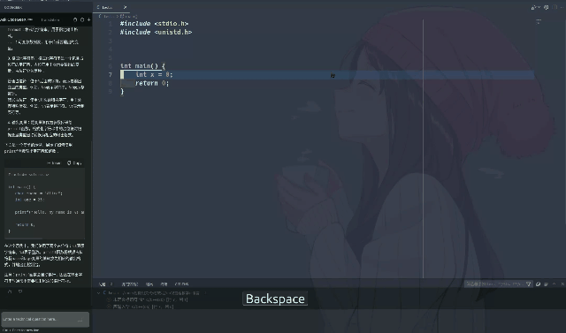

# **vscode 总结经验**

> vscode 个人总结
> 作者: luoyebai

[TOC]

## **前言**

相信各位用 vscode 写代码总感觉不够爽吧,接下来我将介绍一下,我个人常用的配置和小技巧,希望可以助各位加深地写代码的愉悦程度(笑).

---

## **vscode快捷键**

首先介绍一些vscode的快捷键,方便各位快速使用.

### **活动面板**

|快捷键|作用|
|---|---|
|ctrl+shift+p|打开命令面板(用中文也可以查找命令)|
|ctrl+k+ctrl+s|打开键盘快捷方式面板|
|ctrl+逗号|打开设置面板|
|ctrl+k+f|关闭工作|
|ctrl+b|切换左侧活动栏|
|ctrl+p|打开文件|
|ctrl+w|关闭当前窗口|
|ctrl+q|退出页面|
|ctrl+减号(或等于号)|页面缩放|
|ctrl+tab|切换文件|
|ctrl+数字按键|聚焦对应编辑器组|
|ctrl+shift+e|打开资源管理器|
|ctrl+shift+f|打开搜索|
|ctrl+shift+d|打开运行和调试|
|ctrl+shift+x|打开扩展面板|

### **编辑器**

|快捷键|作用|
|---|---|
|ctrl+s|保存|
|ctrl+z|撤回|
|ctrl+y|撤回撤回|
|ctrl+回车|插入到下一行|
|ctrl+shift+回车|插入到上一行|
|ctrl+shift+p|显示所有命令|
|ctrl+shift+o|转到编辑器中符号|
|ctrl+shift+\ |转到括号|
|ctrl+g|转到行/列|
|ctrl+方向键|按单词移动|
|ctrl+ `(tab 上面那个)|切换终端|
|ctrl+k+ctrl+l|代码块折叠|
|ctrl+k+ctrl+o|代码块折叠展开|
|ctrl+l|选择当前行|
|按住 ctrl 后点击函数(变量)|跳转到定义|
|ctrl+空格|触发提示|
|F2|重命名|
|ctrl+k+z|进入禅模式|

### **调试**

|快捷键|作用|
|---|---|
|F5|编译运行|
|shift+F5|停止运行|
|ctrl+shift+F5|重新运行|
|F6|暂停|
|F10|单步调试|
|F11|进入当前函数中调试|
|shift+F11|跳出进入的函数|

---

## 好用的命令(待更新)

---

## **vscode 设置文件**

我的settings.json文件,各位可以参考一下.
[点击即可查看settings.json](./src/settings.json)

---

## **插件推荐**

接下来是插件推荐

### 翻译相关(待更新)

1. Chinese (Simplified)
vscode中文扩展
2. Vscode Google Translate
alt+shift+t----翻译并替换选中段落
3. TranslationToolbox
ctrl+alt+t----翻译不替换

### **美化相关**

美化vscode,让写代码更加愉悦

#### 主题推荐

主题相关,主要介绍两款

在扩展中搜索theme,可看到许多主题插件

1. One Dark Pro
效果如下:

2. Community Material Theme
效果如下:
主题1

---

主题2

---

主题3

---

主题4

#### 文件栏图标推荐

介绍两个图标插件

1. Material Icon Theme

2. vscode-icons

---

#### 编辑器美化

1. indent-rainbow

使用前:

使用后:

2. Trailing Spaces

使用前:

使用后:

3. Better Comments

有颜色的注释.

4. Error lens

报错在显示编辑器上.

5. Image preview

显示图片.

6. 背景美化----background

注意,这个拓展透明度不能写0,会让编辑器看不清
如果不小心设置为0了,重装一下vscode就好,不用解压,直接覆盖
效果:vscode后加上背景

效果如图所示

### **实用插件**

#### **全局**

1. CodeGeeX

人工智能补全,免费.

2. codesnippet

生成代码块.

3. Doxygen Documentation Generator

自动生成注释.

#### git(待更新)

git套装
包括三个插件
gitlens
git history
git graph

#### c/c++(待更新)

c++套装包括四个插件
C/C++ Extension Pack
cpp-check-lint
Clang-Format
Cmake Tools

#### 其他(待更新)

1. licenser
生成开源许可

2. Project Manager
保存项目

3. Bookmarks
书签

4. 远程连接
Remote - SSH
Remote Explorer

5. 其他
compareit
Draw.io Integration
Competitive Programming Helper (cph)
CodeSnap
xml+yaml
vim
